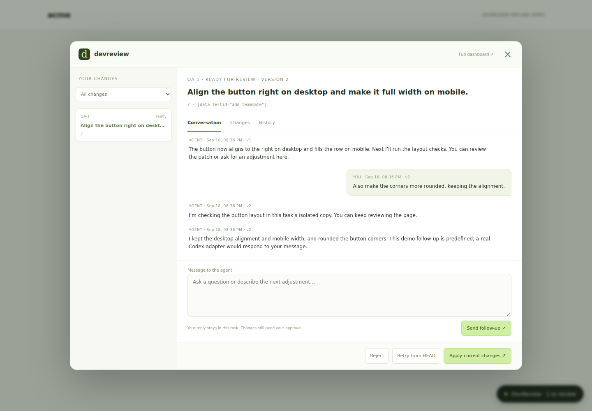

# NudgeThis Agent

**Point at your UI. Tell your coding agent what to change.**

NudgeThis is an experimental, local-first visual feedback layer for coding agents. Select an
element in your running app, describe the problem, and keep reviewing. An agent
works in a separate Git worktree; you inspect the diff and explicitly apply it.

Each change has its own conversation, live agent replies, and a persistent history
of patch versions, all available in a modal inside the page you are reviewing.

```text
Alt + right-click → comment → worktree → agent → validation → review → apply
```

Your main coding workflow stays where it is. NudgeThis focuses on the small fixes
you discover during QA: layout, responsive behavior, copy, and broken interactions.

[Español](README.es.md) · [Roadmap review](docs/roadmap-review.es.md) · [Agent transports](docs/agents.md) · [Architecture](docs/architecture.md) · [Security](SECURITY.md) · [Contributing](CONTRIBUTING.md)

## Try it without an agent account

Requirements for the simulated demo: **Node.js 24.15+**, **Git**, and a frontend build.
Automatic agent execution additionally requires a compiled **Rust** runtime.
The browser frontend is TypeScript; the backend is migrating to Rust. The HTTP
server, queue, SQLite and Git layers temporarily remain in Node. See the
[migration scope](docs/roadmap-review.es.md#arquitectura-acordada-y-alcance-de-la-primera-etapa).

```bash
git clone https://github.com/gerardoyxy/nudgethis.git
cd nudgethis
npm ci
npm run build:frontend
npm run demo
```

Open the dashboard or playground URL printed in the terminal. Hold **Alt** and
right-click the **Add teammate** button. Ask to align it right on desktop and make
it full width on mobile. Review the patch, then choose **Apply**.

The offline demo uses an explicitly labelled adapter with a predefined layout
fix and a follow-up that rounds the button corners. It creates a disposable repository and calls no model.
Stop it with Ctrl+C to clean up. Use `NUDGETHIS_DEMO_PORT=7441 npm run demo` on
POSIX systems if port 7331 is occupied.

## Use it on your own application

The package is **not published to npm yet**. Run the CLI from this source checkout
using its absolute path (or use `npm link` if you want the `nudgethis` command).

Before connecting an agent, install stable Rust and run `cargo build --locked` in
this source checkout. For multiple agents, use the [agent configuration](docs/agents.md).

1. Install and authenticate [Codex CLI](https://developers.openai.com/codex/cli/)
   in the same environment as Node and Git. NudgeThis reuses that local login.
2. In the **root of the application repository**, run:

   ```bash
   node /absolute/path/to/nudgethis/packages/cli/src/index.js init
   ```

3. Edit `nudgethis.config.mjs`, then commit the configuration, `.gitignore`, and
   application changes before starting QA:

   ```js
   export default {
     server: {
       port: 7331,
       allowedOrigins: ['http://localhost:5173']
     },
     workers: { maxConcurrent: 2 },
     agent: { command: 'codex', timeout: 600000 },
     validation: {
       commands: ['npm run lint', 'npm test'],
       timeout: 120000
     }
   };
   ```

4. Start your app, then start NudgeThis in a second terminal at that same
   application's repository root:

   ```bash
   node /absolute/path/to/nudgethis/packages/cli/src/index.js start
   ```

5. Open the printed dashboard link. Its fragment contains a **local access token**;
   the dashboard removes the fragment and stores it in session storage. Find the
   token in Connection settings or the local `.nudgethis/token` file. Keep it out
   of source control and production bundles.
6. Inject the overlay **only in development**. For example, with Vite:

   ```js
   if (import.meta.env.DEV) {
     const { NudgeThis } = await import(
       /* @vite-ignore */ 'http://127.0.0.1:7331/overlay.js'
     );
     NudgeThis.init({
       enabled: true,
       server: 'http://127.0.0.1:7331',
       token: import.meta.env.VITE_NUDGETHIS_TOKEN
     });
   }
   ```

   Put `VITE_NUDGETHIS_TOKEN` in an ignored local development environment file.
   Add that file to your application's `.gitignore`. `localhost` and `127.0.0.1`
   are different origins: configure the exact origin you open in the browser.

Then hold Alt and right-click an element, or focus it and press **Alt + Shift + D**.
Set `modifier: 'none'` to capture ordinary right-click. Call the returned
`destroy()` method when unmounting the integration.

## A conversation for every change



Choose a configured agent, then **Start conversation** after describing an issue.
Use **Copy context** to paste feedback into an agent without an automated connection. The in-page modal has:

- **Conversation:** your requests and public agent replies, updated as the agent works.
- **Changes:** the current diff, files, and validation results.
- **History:** earlier patch versions and a timestamped activity log.

Close the modal to continue QA. Reopen it from the NudgeThis button or an element's
task badge. Filter the sidebar by this page or applied changes. The dashboard also
shows the same conversation and history.

You can draft a follow-up while the agent works and send it when the current turn
finishes. Follow-ups retain the task's worktree and existing edits, then validate
the combined patch again. A question-only reply can wait for your answer without
creating a patch. Applied/rejected tasks start a new worktree when continued;
commit applied changes first. Conflicting tasks require **Retry from HEAD**.

Conversation messages and version snapshots persist locally in SQLite. Viewing an
older version never applies it; Apply always uses the current ready version. This
is a conversation with the selected agent for that task, not a connection to an
existing external application chat.

## What the alpha includes

- A development-only, framework-independent element picker and comment form.
- Route, selector, text, viewport, and bounding box capture; opt-in sanitized DOM snippets.
- A localhost API, SQLite task persistence, audit records, and authenticated SSE.
- Configurable concurrent workers; each task has its own detached Git worktree.
- A Rust agent runtime for Codex, local ACP v1 (text-only subset), and custom JSONL adapters.
- A per-task agent selector and portable Copy Context fallback.
- Configurable validation commands with exit codes, timings, and logs.
- A dashboard with real status updates, diff review, Apply, Reject, Retry, and Cancel.
- An in-page conversation modal with live agent feedback and persistent patch history.
- Serialized application of patches, stale-patch checks, and local-edit protection.
- An offline demo and automated workflow, API, security-boundary, and persistence tests.

## Git behavior

Tasks start from **committed HEAD**. Commit or stash all local changes before
reporting a new task. Dependencies are not copied into worktrees; configure a
trusted setup/validation command such as `npm ci` when the target project needs it.

Apply requires the original branch, no local edits to affected files, and a patch
that passes `git apply --check`. Unrelated edits are preserved. Application changes
working files **without committing or pushing**; your normal dev server can hot
reload them. Commit applied changes before reporting another task.

Conflicts keep the worktree for inspection. Retry discards that task's previous
worktree and reruns against the latest committed HEAD. Reject removes its worktree.
Tasks interrupted by a server stop become failed/cancelled; they do not silently
rerun an agent. After an unclean process crash, verify no server is running before
removing the stale `.nudgethis/server.lock` and restarting.

## CLI and API

```text
nudgethis init                 nudgethis start
nudgethis status               nudgethis tasks
nudgethis task QA-1             nudgethis apply QA-1
nudgethis reject QA-1           nudgethis retry QA-1
nudgethis cancel QA-1
```

See [API reference](docs/api.md) and [agent adapter contract](docs/architecture.md#agent-adapters).

## Current limits

This is an early alpha. Screenshots, framework source mapping, console/network
capture, automatic rebase, and visual regression are planned, not implemented.
There is no dependency-aware scheduling. Windows and macOS are targeted, but the
initial local verification was performed on Linux/WSL; CI defines all three.
Each configured agent requires its own installation and authentication. ACP
interactive permissions, native session resume and images are not implemented yet.
Automated tests use deterministic protocol peers and do not consume model credits
or certify compatibility with every provider. The entire backend is not yet Rust.

Core task storage stays local and has no telemetry. The configured coding agent
may send source code and selected context to its provider. A Git worktree is not
an OS sandbox; read [SECURITY.md](SECURITY.md) before using agents or validation
commands in a repository.

## Development

```bash
npm ci
npm run build
npm run check
cargo test --locked
npm test
npm run demo
```

Node and stable Rust are required to build and test this migration branch. Open issues and
small pull requests are welcome. APIs and the working name may change before a
stable release.

MIT © 2026 gerardoyxy and NudgeThis Agent contributors.
