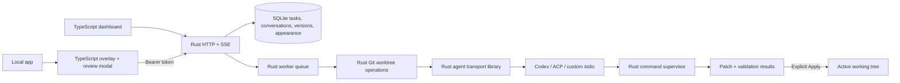

# Architecture

`nudgethis` is one executable with embedded, compiled browser assets. No Node bridge or
JavaScript backend remains. Node is used by build scripts and the black-box test harness;
default tests run application fixtures with execution disabled. Agent fixtures are separate opt-in tests.

| Path | Responsibility |
| --- | --- |
| `crates/nudgethis/src/main.rs` | CLI, setup, shutdown and disposable Rust demo |
| `config.rs` | Trusted TOML configuration and registered agents |
| `server.rs` | Axum loopback HTTP, bounded JSON, auth, origin/Host validation, SSE and assets |
| `core.rs` | Repository ownership, lifecycle, queue, concurrency, messages and actions |
| `store.rs` | SQLite, WAL-aware migration backup, tasks/messages/revisions/audit/preferences |
| `git.rs` | Detached worktrees, safe patch collection, apply checks and cleanup |
| `process.rs` | Bounded, cancellable validation/Git subprocesses with process groups/jobs |
| `appearance.rs` | Appearance schema constraints and uploaded-font limits |
| `crates/agent-runtime` | Reusable Rust transport library plus protocol-test executable |
| `packages/overlay` | TypeScript capture, review and shared appearance editor |
| `packages/server/public` | Dashboard HTML/CSS/TypeScript, embedded at Rust compile time |
| `packages/contracts` | Strict browser API types, checked against black-box HTTP behavior |
| `tests` | Node test client invoking real Rust binaries and disposable Git fixtures |

## Lifecycle and consistency

`draft → pending → analyzing → preparing → working → validating → ready → applying → applied → undoing → undone`

Other review states are `awaiting_feedback`, `failed`, `cancelled`, `conflict`, `rejected`,
`recovery_required`. Drafts and preparation are optional stages.
An agent reply without a patch waits for feedback. Follow-ups increment the attempt and reuse
the worktree, except after Apply/Reject/Undo. Retry captures the current workspace, including local edits. The latest requested
attempt must match the stored version before a UI action runs. CLI actions target the latest.

Queue actions serialize through a control mutex. A bounded number of turns run concurrently.
Git worktree metadata and application of patches serialize separately. Process cancellation
stops the tree before the turn completes. A cancellation token spans agent and validation.
The server's stop token cancels active work; SQLite recovers interrupted execution as failed
and interrupted Apply/Undo as recovery_required.

SQLite preserves the Node alpha's JSON task rows and additive message/revision tables.
Task update, audit insertion and terminal revision write share one transaction. Version 0
databases receive a SQLite backup, including committed WAL data, before the schema transaction.
Reopening version 1 does not duplicate messages or backups. Future schema versions are refused.
Earlier patch contents remain available; Apply/Reject update their version's status.

The agent receives an allowlisted task envelope and at most 128 KB of recent message text;
the shared prompt also caps conversation at 48,000 characters. Full history remains in SQLite.
No provider credentials, browser-supplied commands or raw prior process logs enter this envelope.

## Agent transports

The queue calls `nudgethis-agent-runtime` directly as a Rust library. Each turn runs one
configured executable in its isolated worktree. Codex JSONL, the supported ACP v1 subset and
custom JSONL normalize public responses into chat events. See [agents](agents.md).
There is no in-process JavaScript adapter API. Existing adapters can expose the stdio protocol
in any language; their own runtime is independent of NudgeThis.

## Appearance

A versioned JSON document stores both palettes, mode, three font roles, base size, radius
and optional base64 WOFF/WOFF2 files. Authenticated updates persist in SQLite and publish
`appearance` SSE notifications. Reconnecting clients refetch preferences. Clients with an
unsaved preview retain it until Save/Cancel; there is no collaborative merge or optimistic
revision control for themes, so the last saved theme wins.

Semantic CSS variables propagate through the dashboard and NudgeThis Shadow DOM. The host
application's root is never changed by the overlay. Fonts load through `FontFace` from bytes,
without public unauthenticated font endpoints or external font URLs. Custom themes can choose
any RGB colors; the editor reports several text contrast pairs and does not guarantee an
entire custom theme meets WCAG.

## Remaining product work

Full element identity, multi-select, opt-in screenshots, post-HMR verification, framework
source evidence and broader provider compatibility remain separate milestones.
Rust HTTP models currently retain the existing JSON schema; generating TypeScript contracts
from typed Rust models remains a follow-up, not a runtime dependency on JavaScript.

## Discovery, snapshots and route coverage

`project.rs` reads bounded project metadata for framework/package-manager suggestions and
executable availability. It never executes diagnostic commands. `route_review.rs` scans
Git-listed source files for route candidates, validates concrete paths and stores explicit
manual desktop/mobile checks through a versioned SQLite preference. The TypeScript
`route-review.ts` frame uses fixed layout widths and optional visual scaling; it is not a
headless browser or full mobile emulator. Scan and review do not enter the worker queue.

`git.rs` uses an independent index to snapshot current source and retains local refs outside
branch history. Apply compares affected files with the captured base and records hashes
before/after. Undo refuses mismatches. The store journals mutation state before file changes;
recovery requires inspection instead of guessing whether to replay. [Details](recovery.md).

Fresh worktrees run trusted setup commands before agent execution; continued worktrees
retain dependencies. Setup and validation have separate result arrays. A source mutation
by either command phase blocks review, and an empty validation list is explicitly unchecked.
