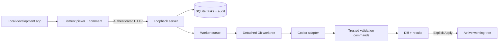

# Architecture



The repository is a small ESM application organized into package directories.
It is intentionally shipped from source for this alpha; independent npm packages
and a compiled TypeScript distribution can follow once the API settles.

| Directory | Responsibility |
| --- | --- |
| `packages/overlay` | Browser context capture, comment UI, element status |
| `packages/server` | Authenticated HTTP/SSE and review dashboard |
| `packages/core` | Trusted config, lifecycle, per-repository server lock |
| `packages/queue` | Persistent tasks, status transitions, concurrency, audit |
| `packages/git` | Worktrees, patches, conflicts, cleanup |
| `packages/agent-sdk` | Provider-independent adapter boundary and Codex adapter |
| `packages/validation` | Trusted shell commands and results |
| `packages/cli` | Local developer commands |
| `packages/shared` | Input validation, process management, serialization |

## Lifecycle

`pending → analyzing → working → validating → ready → applying → applied`

Terminal/review states also include `failed`, `cancelled`, `conflict`, and `rejected`.
SQLite records state changes and audit entries. Interrupted active states become
failed on recovery. No automatic apply, commit, push, or model retry occurs.

The queue limits concurrent agent processes. Git metadata operations and Apply
are serialized. Independent tasks can run simultaneously, but two patches touching
the same local file cannot overwrite each other. A patch is collected before
validation and compared afterward; validation that modifies source fails the task.

## Agent adapters

Any object with this interface can be passed to `startServer({ root, agent })`:

```ts
interface CodingAgent {
  name: string;
  run(input: {
    task: { id: string; request: string; context: Record<string, unknown> };
    cwd: string; // isolated worktree
    signal: AbortSignal;
  }): Promise<{ output?: string; stderr?: string }>;
}
```

An adapter must honor cancellation, edit only `cwd`, and return after all its
children stop. It must not commit, push, or mutate the active checkout. Worktree
isolation is not a security boundary: each adapter needs its own sandbox.

The initial adapter invokes `codex exec --sandbox workspace-write --json -` and
passes context through stdin. Its model is left to local Codex configuration;
`agent.model` can explicitly select one. No provider API key is stored by DevReview.
See [Codex non-interactive mode](https://developers.openai.com/codex/noninteractive/).

## Next milestones

1. Harden cross-platform behavior and package installation.
2. Add opt-in local screenshots and a Docker integration example.
3. Add framework source mapping and console/network evidence.
4. Experiment with file-aware scheduling and explicit rebase flows.

The [original project brief](PROJECT.md) describes the broader vision; it is not
a claim that every roadmap item is implemented in this alpha.
