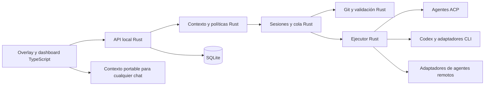

# Validación de ROADMAP 2 y migración TypeScript/Rust

Fecha: 2026-09-18. Base auditada: `0e42f0b` (`0.1.0-alpha.2`).
Documento recibido: [ROADMAP 2, conservado sin cambios](ROADMAP-2.source.md).

El roadmap describe bien el producto: una capa de feedback visual entre el navegador
y los agentes de código. La implementación anterior ya resuelve selección individual,
conversación por tarea, versiones, cola, worktrees, validación por comandos y aplicación
explícita. No completa todavía el MVP 0.1 del documento: faltan multi-select, capturas,
Undo y detección/verificación del hot reload.

La decisión del propietario es usar **TypeScript para el navegador y Rust para todo
el backend**, con comunicación independiente del proveedor. Esta entrega comienza
esa migración; no declara terminadas las 72 ideas ni todo el backend Rust.

## Hallazgos que cambian las prioridades

1. **Una tarea no es un elemento.** Las conversaciones pertenecen a `QA-n`; un selector
   permite colocar su marcador. Seleccionar de nuevo un elemento no recupera por sí
   solo una identidad persistente. Hace falta `ElementAnchor` separado de `Task`.
2. **Applied no significa verified.** El parche modifica archivos locales; el servidor
   de desarrollo puede recargarlos, pero hoy DevReview no confirma render, intención
   ni errores visuales. Añadir estados separados para aplicado y verificado.
3. **Reject y Retry no son Undo.** Ninguno revierte un cambio ya aplicado. Undo necesita
   la preimagen, la postimagen y una comprobación de cambios posteriores por archivo;
   nunca debe hacer `reset --hard` ni descartar el trabajo del usuario.
4. **Concurrencia no significa combinación segura.** Ya corren tareas en worktrees
   independientes, pero no existe planificación por dependencias ni merge automático.
   Mantener Apply serializado y conflictos explícitos.
5. **La arquitectura extensible no equivale a soporte para todos los agentes.** En la
   base solo había un adaptador real, Codex, elegido para toda la cola. La nueva etapa
   aporta registro y selección por tarea, un ejecutor Rust y tres transportes.
6. **El producto no integra GitHub por tener un repositorio en GitHub.** Issues, PRs,
   permisos de cuentas y exportaciones son funcionalidades futuras separadas.
7. **El límite actual exige HEAD limpio.** Después de Apply quedan cambios sin commit;
   abrir otra tarea exige guardarlos. Esto interrumpe el objetivo “click → type → enter”.
   Diseñar una sesión de revisión con snapshot propio antes de permitir Instant Mode.
8. **Los worktrees no heredan las dependencias instaladas.** Separar preparación de
   entorno de validación; una instalación de dependencias no debe confundirse con
   verificar el resultado visual. Docker no se resuelve cambiando la dirección del bind.

## Contraste completo de las 72 propuestas

Estados referidos a la base auditada: **Existe**, **Parcial** y **Pendiente**.
“Parcial” identifica una base útil, no cumplimiento completo. La columna final señala
evidencia del código o el trabajo necesario. Los cambios de esta entrega se detallan
después, para no confundir implementación previa y nueva.

| # | Propuesta | Base | Evidencia o diferencia |
|---|---|---|---|
| 1 | Core Product Loop | Parcial | Selección → agente → validación → Apply; sin confirmación del render. |
| 2 | Element Selection | Parcial | Alt + clic derecho; sin hover inspector ni navegación entre nodos. |
| 3 | Multi-select | Pendiente | Un solo `context` por tarea. |
| 4 | Area Selection | Pendiente | Sin selección de región ni captura. |
| 5 | Visual Prompt Bubble | Parcial | Formulario contextual; Enter en textarea no envía. |
| 6 | Persistent Conversations per Element | Parcial | SQLite por tarea, no por identidad estable del elemento. |
| 7 | Visual History Bubbles | Parcial | Marcadores por selector/tarea; asociación frágil al cambiar DOM. |
| 8 | Page Feedback Overview | Parcial | Filtros de página/aplicados; sin sesiones ni estado revertido. |
| 9 | Fix All | Pendiente | No existe una petición agrupada con revisión de conflictos. |
| 10 | Instant Mode vs Review Mode | Parcial | Revisión por tarea; sin Instant ni sesión de review acumulada. |
| 11 | Agent-Agnostic Architecture | Parcial | Interfaz inyectable `run`; solo Codex productivo y un agente por cola. |
| 12 | Copy Context | Pendiente | Añadido en la primera etapa de migración. |
| 13 | Smart Source Detection | Parcial | `data-devreview-source` como pista manual, sin resolver archivo/línea. |
| 14 | Framework Integrations | Pendiente | Ejemplo de inyección Vite; no es integración de componentes/source maps. |
| 15 | Context Engine | Parcial | Allowlist, recortes y DOM opcional; sin contexto semántico. |
| 16 | Screenshot Context | Pendiente | Sin captura ni transporte de imágenes. |
| 17 | Before / After | Pendiente | Historial de diffs, no de capturas. |
| 18 | Undo | Pendiente | Apply no tiene acción inversa. |
| 19 | Diff Viewer | Parcial | Diff textual, Apply/Reject; sin Undo ni abrir archivo. |
| 20 | Git Awareness | Existe | Branch, HEAD, estado limpio, archivos afectados, worktree y diff. |
| 21 | Session History | Parcial | Mensajes, auditoría y revisiones; faltan sesiones y screenshots. |
| 22 | Page Sessions | Parcial | Ruta almacenada y filtro; sin entidad de sesión por página. |
| 23 | Severity & Feedback Types | Pendiente | No hay categorías ni severidad. |
| 24 | Responsive QA | Parcial | Viewport y bounding box capturados; sin escenarios responsive. |
| 25 | Console Context | Pendiente | No se captura consola del navegador. |
| 26 | Network Context | Pendiente | No se capturan requests/responses. |
| 27 | Automatic Bug Context | Pendiente | Sin registro de excepciones/interacciones. |
| 28 | Accessibility Mode | Pendiente | Accesibilidad del propio modal no equivale a auditar la aplicación. |
| 29 | Visual Consistency Detection | Pendiente | No se comparan estilos de elementos. |
| 30 | Natural Language Selection | Pendiente | Selección directa solamente. |
| 31 | Global Project Instructions | Parcial | Prompt solicita leer instrucciones del repo; sin reglas propias persistentes. |
| 32 | Design System Awareness | Pendiente | Sin análisis de tokens/configuración. |
| 33 | Component Awareness | Pendiente | DOM sin grafo de componentes. |
| 34 | Impact Analysis | Pendiente | Sin análisis de usos compartidos. |
| 35 | Agent Plan Preview | Pendiente | Respuestas públicas; no plan estructurado ni aprobación por etapa. |
| 36 | Verification | Parcial | Comandos configurados; sin render ni comprobación de elemento. |
| 37 | Auto Verification | Pendiente | No se contrasta intención con resultado visual. |
| 38 | Visual Regression | Pendiente | Sin baseline ni comparación visual. |
| 39 | Comments Without Agent | Pendiente | Crear tarea inicia cola. Copiar contexto no equivale a feedback persistente. |
| 40 | Shareable Review Sessions | Pendiente | No hay exportación de sesión. |
| 41 | Team Mode | Pendiente | Un usuario/local, sin roles ni colaboración. |
| 42 | Issue Export | Pendiente | Sin exportadores; Copy Context nuevo no crea issues. |
| 43 | GitHub Integration | Pendiente | Publicación del código no es integración de producto. |
| 44 | PR Visual Review | Pendiente | Sin asociación de revisión visual a PR. |
| 45 | Prompt Templates | Pendiente | Texto libre solamente. |
| 46 | Keyboard Shortcuts | Parcial | Esc y Alt+Shift+D; faltan los otros atajos propuestos. |
| 47 | Command Palette | Pendiente | No existe. |
| 48 | Open Source File | Pendiente | No existe enlace verificable archivo/línea/editor. |
| 49 | Element Metadata | Parcial | Selector, tag, texto, viewport, rect y pista source; no componente. |
| 50 | Selection Persistence & Element Identity | Parcial | `querySelector` al actualizar/scroll; sin reconciliación de identidad. |
| 51 | Context Budget | Parcial | Límites de caracteres y 32 KB por tarea; Project context añade 16 KiB por elemento, 128 KiB de biblioteca y 48 KiB por selección. Sin presupuesto semántico/tokenizado. |
| 52 | Agent Routing | Pendiente | Sin elección por complejidad. Esta etapa añade elección manual por tarea. |
| 53 | Parallel Fixes | Parcial | Workers concurrentes y Apply serializado; sin merge seguro automático. |
| 54 | Project Memory | Implementado (explícito) | Project context guarda instrucciones, skills de texto y documentación por proyecto; selección por conversación y snapshot por versión. Sin memoria inferida ni descubrimiento automático. |
| 55 | Design Comparison | Pendiente | Sin referencia visual/Figma. |
| 56 | Make This Look Like That | Pendiente | Requiere selección múltiple y estilos estructurados. |
| 57 | QA Agent | Pendiente | No hay exploración automática. |
| 58 | Autonomous QA | Pendiente | No hay crawler de rutas. |
| 59 | User Flow QA | Pendiente | No hay definición/ejecución de flows. |
| 60 | State Testing | Pendiente | No hay fixtures de estados de UI. |
| 61 | Visual Timeline & Session Replay | Parcial | Auditoría de tareas, no replay del navegador ni evolución visual. |
| 62 | Generate Demo | Pendiente | Demo fija existente; no grabación generada del trabajo del usuario. |
| 63 | Share Change | Pendiente | Sin artefacto exportable before/after. |
| 64 | Plugin Architecture | Parcial | Interfaz interna de agente; sin protocolo/plugin versionado. |
| 65 | MCP Support | Pendiente | Ni servidor ni herramientas MCP del producto. |
| 66 | CLI & Zero-config Goal | Parcial | CLI desde source; `private: true`, no paquete npm publicado. |
| 67 | Docker Support | Pendiente | Falta resolver mounts, hosts, puertos, permisos y credenciales. |
| 68 | Security & Permissions | Parcial | Loopback/token/origin; Codex solicita sandbox; no modos generales. |
| 69 | Dangerous Change Detection | Parcial | Rechaza symlinks/submódulos/env; no clasifica auth/DB/dependencias. |
| 70 | Privacy | Parcial | Minimización local; el proveedor puede recibir contexto/código. |
| 71 | Performance | Parcial | Overlay pequeño; falta medir observers, scroll y contexto por demanda. |
| 72 | Framework Independence | Parcial | Base DOM universal; faltan pruebas específicas entre frameworks. |

Evidencia principal de la base: `packages/overlay/src/index.js`, `review.js`,
`packages/queue/src/index.js`, `store.js`, `packages/git/src/index.js`,
`packages/agent-sdk/src/index.js`, `packages/shared/src/index.js`, `packages/server/src/index.js`
y las pruebas de workflow, persistence, server y conversations en el commit auditado.
Los archivos del navegador pasan a `.ts` en esta entrega.

## Arquitectura acordada y estado de la migración

Objetivo final:

El DOM, eventos del navegador, selección y extracción inicial de contexto siguen en
TypeScript porque viven en el navegador. Rust valida, reduce, almacena y distribuye
ese contexto. Rust no elimina los permisos del proveedor ni vuelve local un modelo remoto.

Implementado en esta rama:

- Frontend TypeScript `strict`, contratos explícitos y compilación separada.
- Workspace Cargo; ejecución, timeout, cancelación y normalización de agentes en Rust.
- Codex JSONL, ACP v1 local por stdio y protocolo JSONL propio para adaptadores externos.
- Registro de agentes en configuración confiable y selector por nueva tarea.
- Contexto copiable para entregar manualmente a un agente sin conexión automática.
- Servidor HTTP/SSE, CLI, configuración TOML, cola, SQLite, Git, validación y demo en Rust.
- Biblioteca de transportes integrada directamente en el servidor, sin puente Node.
- Migración de bases anteriores con respaldo SQLite, recuperación y conservación de mensajes/versiones.
- Recursos web embebidos en el ejecutable; Node queda para build y pruebas, o requisitos propios de agentes.
- Apariencia personalizable y persistente: dos paletas, fuentes locales/subidas, tamaño, radio e import/export.

La migración del runtime está completa. La distribución de binarios por plataforma y la
publicación de paquetes son trabajo posterior; el repositorio ofrece compilación desde fuente.

## Compatibilidad con agentes: promesas verificables

| Nivel | Resultado | Límite actual |
|---|---|---|
| Contexto portable | Copiar selección + petición a cualquier agente que acepte texto | Respuesta manual; no sincroniza chats externos. |
| Proceso personalizado | Recibe un envelope JSON por stdin y emite mensajes JSONL | Necesita adaptador/wrapper; no interpreta automáticamente cualquier CLI. |
| Codex | Ejecuta CLI con sandbox solicitado, mensajes públicos y conversación como contexto | Autenticación externa; no adjunta una conversación de Codex App. |
| ACP local | Negocia v1, crea sesión y recibe respuestas públicas | Solo texto; sin permisos interactivos, filesystem/terminal del cliente ni reanudación. |
| API de agente remoto | Objetivo posterior | Requiere transferencia controlada del repo/parches y manejo de credenciales. |

La negociación y las capacidades opcionales vienen del [protocolo ACP](https://agentclientprotocol.com/protocol/v1/initialization).
Esta etapa anuncia capacidades mínimas y rechaza solicitudes no implementadas; no
anuncia imágenes o reanudación aunque un agente las soporte.

**ACP y MCP son complementarios.** ACP conecta cliente y agente; MCP permite ofrecer
contexto y herramientas al agente. Un futuro servidor MCP de DevReview no sustituye
el control de sesiones del adaptador. [Arquitectura MCP](https://modelcontextprotocol.io/docs/learn/architecture).

Las pruebas usan procesos simulados deterministas. No certifican compatibilidad real
con todas las versiones de Codex, Claude Code, Cursor, Copilot u otros productos.
Cada integración publicada debe documentar versión, autenticación, capacidades y prueba real.

## Roadmap revisado con criterios de salida

| Etapa | Entrega | Criterio de salida |
|---|---|---|
| M1 - implementada | TS estricto + ejecutor Rust + registro de agentes + Copy Context | Flujo probado hasta Apply, cancelación de descendientes, rechazo de agente desconocido y pruebas de protocolo. |
| M2 - implementada | Servidor, CLI, SQLite, cola, Git y validación en Rust | Misma API con pruebas de paridad; migración de DB con backup y recuperación; binario de runtime sin Node. |
| M3 | Identidad de elemento, multi-select, captura opcional y before/after | Reidentificación con nivel de confianza; captura redactada y límites; degradación clara sin imagen. |
| M4 | Undo, sesiones y verificación tras Apply | Undo rechaza cambios ajenos; applied/verified separados; detección de HMR/render y resultado visible. |
| M5 | React/Vite/Next, source mapping y segunda integración real certificada | Archivo/línea con evidencia, fallback DOM, permisos interactivos y smoke tests por proveedor. |
| M6 | Review sessions, Fix All, exportación, MCP y empaquetado | Conflictos visibles, formatos versionados, artefactos y binarios por plataforma. |
| Después | QA autónomo, routing automático, equipos y nube | Solo después de medir estabilidad y resolver el flujo central. |

M1 y M2 cubren la migración tecnológica, no todas las propuestas de producto. Las pruebas
anteriores de API, seguridad, Git y persistencia se portaron a pruebas de caja negra contra
el ejecutable Rust con fixtures equivalentes. No se ejecutan dos colas contra la misma base.
La [guía de migración](migration.es.md) explica configuración, respaldo y recuperación.

Modelar explícitamente `Project`, `ReviewSession`, `ElementAnchor`, `Task`, `AgentRun`,
`Message`, `Revision` y `Artifact` en M3 y siguientes, con relación y agente por ejecución.
Persistir identificadores de eventos y soportar reconexión desde un cursor; el SSE
actual solo notifica que hay que volver a pedir la tarea.

## Mejoras de producto propuestas

- Priorizar **Copy Context** y comentarios sin agente para que el primer uso no
  dependa de cuenta, proveedor ni consumo de modelos.
- Mantener Review como comportamiento inicial. Instant requiere Undo y políticas
  explícitas; “UI change” no basta para decidir que un parche es seguro.
- Elegir cómo capturar antes de prometer screenshots: permiso del navegador o
  integración de captura, tratamiento de iframes/canvas y redacción antes del envío.
- Source mapping debe devolver archivo, línea, origen de evidencia y confianza;
  no presentar nombres de componentes inferidos como hechos.
- Separar permisos para leer contexto, editar el worktree, ejecutar comandos,
  usar red y aplicar al checkout. Un worktree y un prompt no son un sandbox.
- Configuración final declarativa (`devreview.toml`); retirar la ejecución de `.mjs`
  al migrar el core, conservando una ruta de importación documentada.
- Mantener Node como herramienta de build opcional para contribuidores del frontend,
  pero no como requisito del binario final. `npx` sería un launcher/distribuidor, no
  el backend. No anunciarlo hasta publicar y verificar paquetes por plataforma.
- Tratar el objetivo de 30 segundos como aspiración. Medir por separado selección,
  cola, arranque, agente, validación, Apply y render; distinguir éxito técnico de
  aceptación humana. Métricas locales y exportación voluntaria, sin telemetría añadida.

## Qué no se ha hecho en esta entrega

No se instalaron agentes de terceros ni se iniciaron sesiones de modelos reales.
No se cambiaron las credenciales de GitHub ni la configuración global de Git.
No se implementaron capturas, Undo, MCP, nube, equipos,
auto-apply, publicación npm ni las otras fases por el solo hecho de aparecer en el roadmap.

## Evidencia de la migración

Verificación local: compilación TypeScript estricta, análisis Rust con Clippy sin
advertencias, pruebas de caja negra que ejecutan el servidor Rust, pruebas de protocolos y pruebas unitarias Rust. Las pruebas conservan los casos de conflicto, cancelación, conversaciones, versiones y persistencia; añaden backup SQLite y temas.
Chromium comprobó selector de agente, copia de contexto con y sin sesión, conversación,
versiones, Apply, persistencia al recargar, dashboard y diseño móvil. Los agentes
fueron simulados; no se ejecutó un modelo real. La matriz CI repite compilación,
análisis y pruebas en Linux, Windows y macOS.

## Project context: extensión implementada

La biblioteca local permite añadir reglas explícitas, skills y documentación pegando texto
o importando `.md`, `.markdown` y `.txt` UTF-8. TypeScript gestiona el editor y la selección;
Rust valida, persiste en SQLite y prepara el mismo snapshot para Codex, ACP y stdio.
Las preferencias definen el contexto inicial; cada mensaje permite cambiar la selección.
**Context used** y el historial muestran el texto y las versiones que se enviaron.
Las modificaciones o eliminaciones de la biblioteca no alteran snapshots existentes.

Los documentos son referencias, no instrucciones implícitas. Las skills son texto
seleccionado por el usuario; no se instalan scripts, assets ni herramientas. Quedan fuera
PDF, imágenes, importación por URL y descubrimiento automático de archivos del proyecto.
Los guardados concurrentes rechazan revisiones antiguas, y las selecciones inválidas o
que exceden el límite se rechazan antes de crear o avanzar una tarea.
